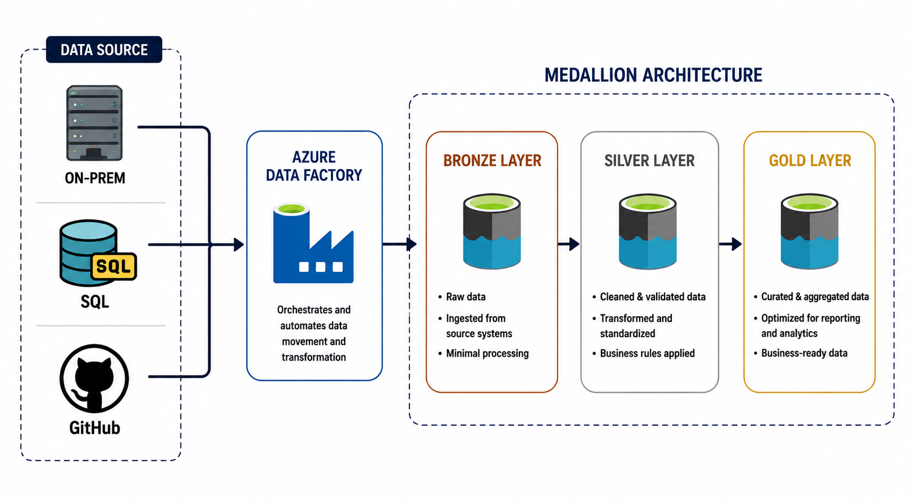

# Azure Data Factory End-to-End Data Engineering Project

## 📖 Project Overview

This project demonstrates the design and implementation of an end-to-end ETL pipeline using Azure Data Factory (ADF) and other Azure services. The pipeline ingests data from multiple sources, including on-premises files, REST APIs (GitHub), and Azure SQL Database, and processes the data using a Medallion Architecture consisting of Bronze, Silver, and Gold layers.

The solution showcases various real-world data engineering concepts such as on-premises to cloud migration, API-based data ingestion, modern incremental loading without traditional watermark tables, and data transformation using Mapping Data Flows. The transformed data is stored in Delta format within the data lake and further processed to generate business-ready datasets in the Gold layer for reporting and analytics.

To automate the entire workflow, Azure Data Factory pipelines are orchestrated through a parent pipeline with scheduled triggers, while a Self-hosted Integration Runtime enables secure connectivity between the on-premises environment and Azure resources. The project demonstrates how Azure Data Factory can be used to build scalable, automated, and maintainable data engineering pipelines using cloud-native services.

---

## 🛠️ Tech Stack

| Technology | Purpose |
|------------|---------|
| **Azure Data Factory (ADF)** | Orchestrates the ETL pipeline and manages data movement across multiple data sources. |
| **Azure Data Lake Storage Gen2 (ADLS Gen2)** | Stores raw, transformed, and curated data across the Bronze, Silver, and Gold layers of the Medallion Architecture. |
| **Azure SQL Database** | Acts as a relational data source to demonstrate modern incremental data ingestion and migration into a data lakehouse without relying on traditional watermark tables. |
| **Self-hosted Integration Runtime** | Enables secure connectivity between on-premises data sources and Azure services. |
| **Mapping Data Flows** | Performs data transformation, cleansing, and data preparation using a visual, code-free interface. |
| **GitHub** | Stores the project source code and project documentation. |

---

## 🏗️ Architecture Diagram

  

---

## 🚀 Project Workflow

1. **Environment & Connectivity Setup**
   - Provision Azure Data Factory, Azure Data Lake Storage Gen2, and Azure SQL Database.
   - Configure a Self-hosted Integration Runtime (SHIR) to establish secure connectivity between the on-premises environment and Azure.
   - Create Linked Services for the on-premises file system, GitHub REST API, Azure SQL Database, and Azure Storage.

2. **Data Ingestion (Bronze Layer)**
   - Migrate on-premises files into the Bronze layer using Copy Activities and dynamic ForEach pipelines.
   - Ingest JSON data from the GitHub REST API into Azure Data Lake Storage Gen2.
   - Perform incremental data ingestion from Azure SQL Database using a modern file-based tracking mechanism instead of traditional watermark tables.

3. **Data Transformation (Silver Layer)**
   - Clean and transform the Bronze data using Mapping Data Flows.
   - Apply data type conversions, column renaming, filtering, and string manipulation.
   - Store the transformed datasets in Delta format within the Silver layer.

4. **Business Serving (Gold Layer)**
   - Join and aggregate Silver layer datasets using Mapping Data Flows.
   - Perform business calculations and ranking operations.
   - Store curated, business-ready data in the Gold layer for downstream reporting and analytics.

5. **Pipeline Orchestration & Scheduling**
   - Integrate all ingestion and transformation pipelines into a Parent Pipeline.
   - Schedule automated execution using Azure Data Factory Triggers.

---

## ⚠️ Challenges Faced

- While building the **Mapping Data Flow**, I initially configured the left stream incorrectly. Since I had deleted the existing flow, I had to recreate the entire data flow from scratch.

- Debugging the **Mapping Data Flow** was challenging, as incorrect column selections sometimes produced unexpected outputs. Identifying and correcting these mapping issues required careful validation and testing.

- Configuring the **ForEach** activity in Azure Data Factory required additional learning, particularly in understanding parameter passing and dynamic content expressions to ensure the pipeline executed correctly.

- During the initial development, I configured the **Retry** policy with a value of **2** for pipeline activities. This resulted in unnecessary Azure execution costs. After understanding its impact, I optimized the retry settings by using **0** for non-critical activities and **1** for critical activities to balance reliability and cost.

---

## 📚 Learnings

- Medallion Architecture (Bronze, Silver, and Gold layers)
- Azure Data Lake Storage Gen2 (ADLS Gen2)
- On-premises to Azure data migration
- API-based data ingestion into Azure
- Azure Data Factory (ADF) pipeline orchestration
- Incremental data loading using Azure Data Factory
- PySpark transformations using Mapping Data Flows
- Self-hosted Integration Runtime (SHIR)
- Mapping Data Flows for data transformation
- Azure SQL Database integration